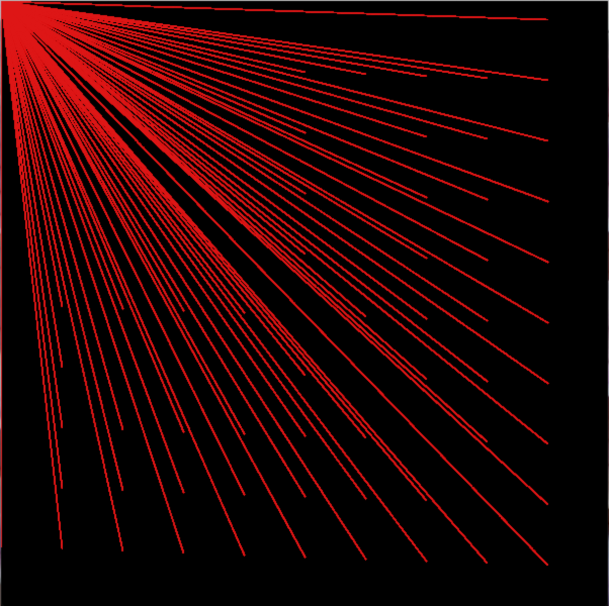

# ASSIGNMENT TWO: ART PROJECT

## Description:
- This assignment requires students to make creative art projects using processing. After learning conditional loops and statements, the students are now able to play with repetitions, hence allowing more room for creativity
- In this project, students are encouraged to use meaningful variable names as well as function names, if any are used.

## The process:
- My favorite part about this assignment was that I had no idea what it was exactly that I wanted to create before I started coding, but once I opened processing and started trying different shapes and functions, I was able to tweak different elements to come up with the final result. This just goes to show that a huge part of the creative process is just diving into the unknown and see what it has in store at that point in time.
- Below are screenshots of different stages of the project

First, I started with sharp red lines all protruding from the upper left corner of my canvas (0,0).

## Difficulties:
- Frankly, this assignment was much easier compared to the first. The biggest roadblock that I came across was lack of direction. Like I stated in the process section, I did not have a clear goal that I was working towards, therefore I pretty much just had to do trial and error. As a person that appreciates organization and orderliness, this was quite challenging.

## Interesting things I discovered:
- Not that I used this in my assignment, but I found out that functions in java can only be used as part of a class (Methods) if one wants to pass variables with them. As someone who is fluent in both Python and C++, I found this to be quite limiting, therefore I had to initiate the same variables in all my functions.

## Outcome:

