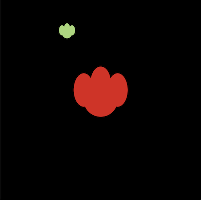
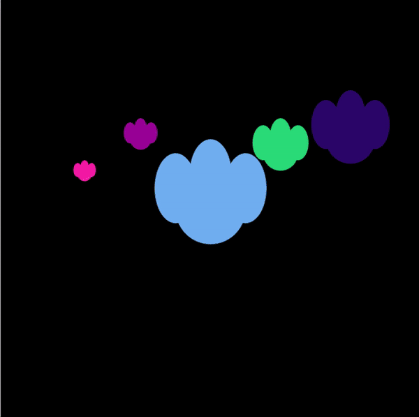
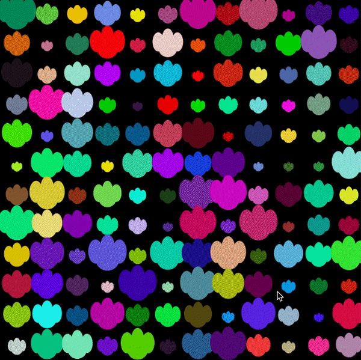

# ASSIGNMENT THREE: ART USING OBJECT-ORIENTED PROGRAMMING

## Description: 
- This assignment requires students to use object-oriented programming to either create a work of art or to make a game. I chose to make a piece of art, because I believe that I would benefit more from employing my creativity without having to worry about technicalities of a game. 
- In this project, students are encouraged to :

## The process:
- As one may be able to tell from my previous projects, I love color. I love mixing so many colors together and having very vibrant works. So naturally, when I started thinking of my ideas for this project, I knew that I wanted something with lots of colors. And after experimenting with the colors of the rainbow last week, I decided to jump on the second most colorful thing I could think of : Flowers. My favorite flowers happen to be tulips, and luckily, they come in almost all possible colors, plus they are really easy to make using ellipses that overlap. 
- Since I knew that I was going to need multiple flowers, I decided to start with just one flower and settle for it once I liked it. So I started with overlapping ellipses to make on flower at the centre using hard coded numbers first. Once I liked what I had, I decided to make a Flower class, so that I would be able to replicate it whenever I needed to add new flower objects.

- Next I decided to instantiate other flower objects, but in different sizes, this means that I needed to figure out the proportions of the ellipses that I combined, so that I wouldn't need to hardcode numbers, and instead just change the proportion sizes depending on the petal size.

- Once that worked, I deciced to use a for-loop to make these flowers instead of calling multiple lines as that would be tiresome, especially because I am using a large screen, so I would need to write at least 400 lines; which is not wise. I also decided to randomize the colors of each flower with a controlled frameRate.
 

- Lastly, I increased the number of flowers to suit my screen size. I made a total of 420 flowers using a nested for loop.

## Difficulties:
- Because I randomize the colors of the flowers, I had a hard time figuring out how to stop the blinking, because it would be too hard on the eyes. I needed to figure out a way to keep the colors permanent, or in the very least... I needed to keep the colors on for longer. So, I solved this by slowing down the frameRate. This helped a lot, but I still was not satisfied with the outcome. I then decided to move the initiating of objects to the setup() function, instead of the draw function, and I moved the color randomization to the flower class, so that each flower is made with a unique color. 
- I wanted to include size changes of each flower whenever the mouse was clicked. But, that proved to be difficult, so instead, I decided to change the flowers' sizes based on whether the frameCount is even or not. I am hoping to keep working on this project even beyond the due date, so hopefully, I will be able to figure it out. 

## Interesting things I discovered:
- I discovered that one can call the setup() function within the draw function. This was useful in my program, because I wanted to create an effect of the growing and dying of flowers. So, when the program starts... all the flowers are fully grown, but they wither over time and become smaller. Some even leave the screen, so the number of flowers decreases as well as their size. But like any other garden, this one involves a new set of flowers once a new season arrives... it just so happens that in mine, a season lasts for 500 frames. After that, new flowers grow and they also go through the same cycle.
- I also discovered the keyCodes, I was able to use them in the program too. If one presses "R", the flowers' movements become randomized, if one presses either "UP" or "DOWN", the flowers shake vertically, and if one presses either "LEFT" or "RIGHT", the flowers shake horizontally.

## Outcome:

