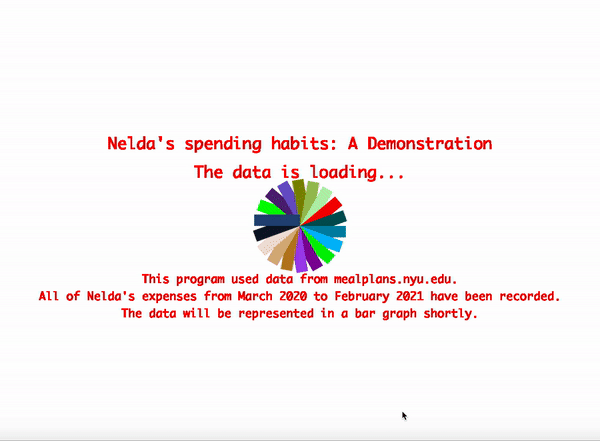
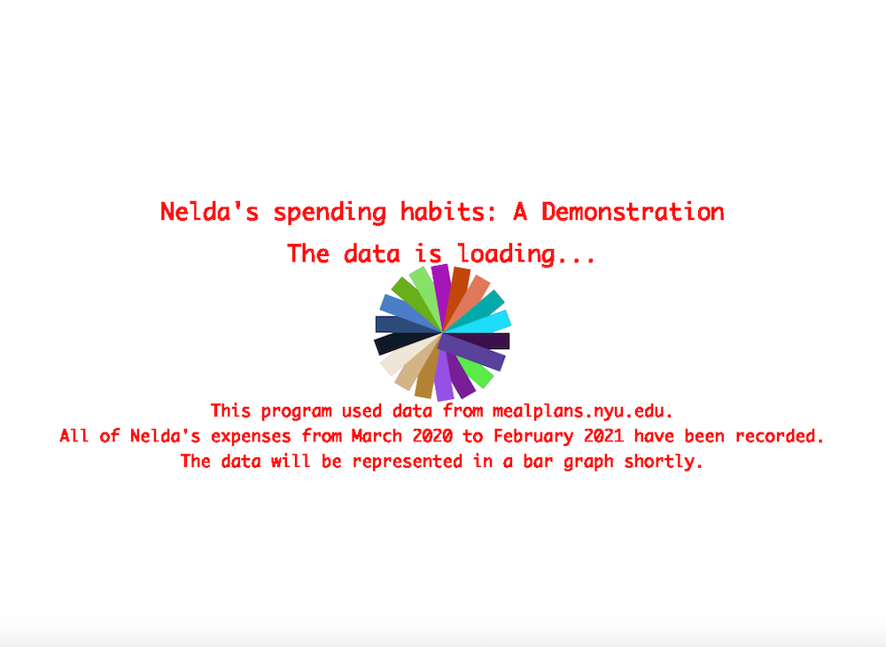

# ASSIGNMENT FOUR: DATA VALIDATION PROJECT

##  Description:
- This assignment requires students to use data to create interesting works of art.
- My project is based on data that I downloaded from mealplans.nyu.edu which is an online site that tracks NYU students' campus cash balance. Every single time money is spent on campus, a record is made, and one can check their balance statements for at most a period of 12 months. So, this project is meant to show my spending habits and what months I spend most money on.

## The Process:
- Initially, I wanted a plain cover to introduce what the project is about, so I settled for a simple description using text and what I consider to be a "cool" background. This is because I found that the data was taking a very long time to load. Therefore, I only use the cover page to buy the program some time to process the data from my csv file.
- To make this cover, I borrowed the wheel that changes color from class practice. I also mention this in the code

- Overall then, a static image of the cover looks like this:

- From this, data.csv file, I store the month value - which is either the first one or two digits in each row of my csv file. After that, I sum up all the negative values in the "amount" column of that month's row. For example, a typical row in the file looks like: "3/01/2020 11:53AM,	AD - Bluemart02 - Charge,	-7.25,	492.94". The third item in this comma-separated line is the amount I store. I created variables for each month, such that if the month reads, say "1"... I will store the charge in the januaryTotal variable. This is repeated for all months of the year, and once it reaches the last row, I stop the loop to avoid increased counting.
- Once I have all the monthly expenditures in their respective variables, I call the drawGraph() function, which in turn draws a bar graph with all the months and their total expenses. 

## Difficulties:
- The biggest challenge was that my laptop could only allow a height of around 800, but some of my y-values (money spent) were greater than that i.e the highest was 1224 AED per month. I figured that I would have to come up with a scale, so I divided 800 by 1224, and I multiplied all the y-values by this proportion so as they all fit in the scale. 
- The other challenge was more of a creative block. Given how fun and colorful all my past projects have been, I just did not enjoy this one as much. I wanted to try and do something creative with the data... but I kept overthinking and ended up doing a bar graph. I overcame this challenge by assuring myself that I ca always do something fun on the side, but what I shoudl focus on right now is whether I am able to understand and apply the concepts that I am learning... which I think I have. 

## Interesting things I discovered:
- I had to learn how to work with string methods in Java. I learnt how to use methods like .length() and .substring() which I needed for my project.
- I noted this from Prof. Shiloh's example in class, but I was able to use it in my assignment too: the use of noloop(). After my data reached the last row, I noticed that the values were still being increased, so I figured that this was because the loop was still running and each time it was adding the last value over and over again... bringing the total money spent for the last month to even past 10,000 AED. And I know I can be a bad spender, but not bad enough to spend 10,000 AED in a month.

## Outcome:
- The final outcome of the graph looks like the image being displayed below:

- And the final compilation of the cover sheet and the graph looks like this:

