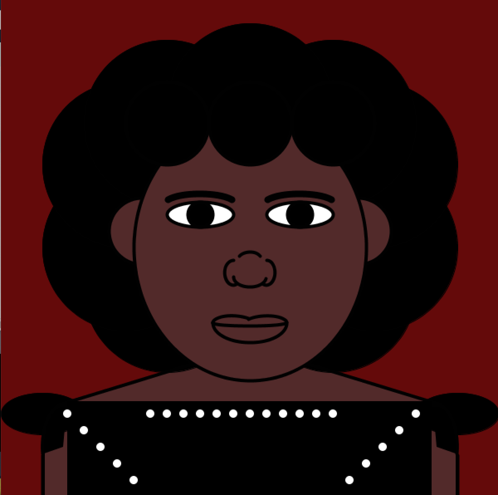

# ASSIGNMENT ONE:SELF-PORTRAIT
## Description:
- This assignment requires students to make self-potraits using processing. Given that this is the first assignment in the course, the students are only required to use basic in-built functions to come with different shapes and facial features.
- The portrait need not be dynamic or realistic, but should be entirely coded by the students. 
## The process:
- I particularly enjoyed coming up with ways to integrate as many features as possible on my self-portrait. I was able to use the reference page that is available to us. From that, I not only read what different functions do, but I also put them into use... which further helps me put my knowledge into use.
### Difficulties:
- The main challenge was hard-coding values. As a previous computer science major, I was taught that hard-coding values is not a good coding habit. Therefore, when I started this assignment... I had a hard time coming to terms with the fact that perhaps human faces are not as symmetrical and proportional as I would want them to be. Yes, including my own. This realization forced me to hard-code some values to give me the desired facial features.
### Interesting things I discovered:
- Perhaps the coolest feature I discovered was the color selector in the tools section of processing. I was having a hard time coming up with the right shade for my skin tone as well as my eyes and hair... and after googling and watching a couple of Youtube videos, I discovered that there is a color selector that lets you pick the color you want first, then gives you the RGB values. I think that is pretty cool and efficient.

## Outcome:

