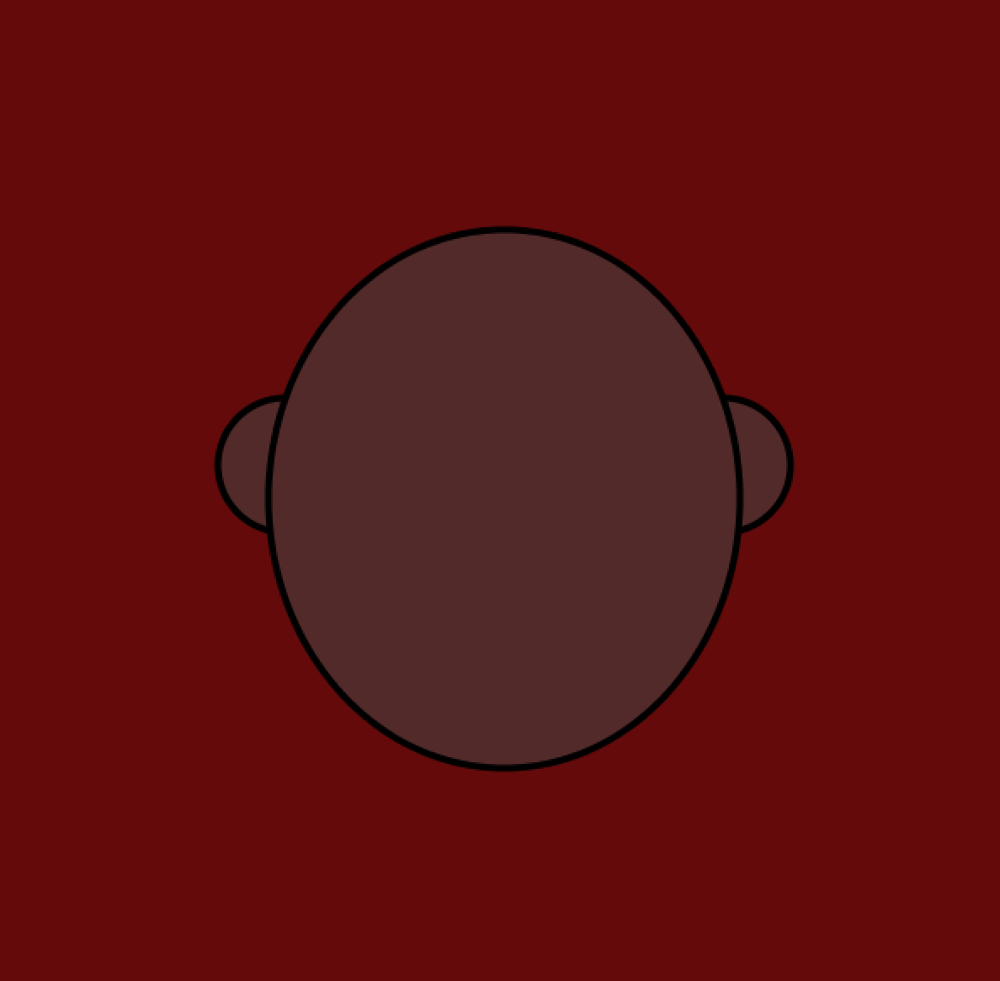
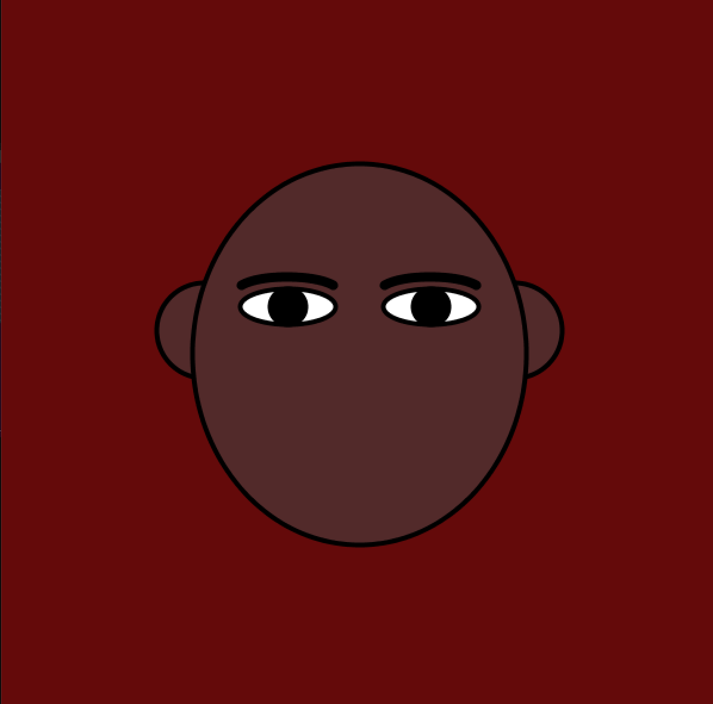
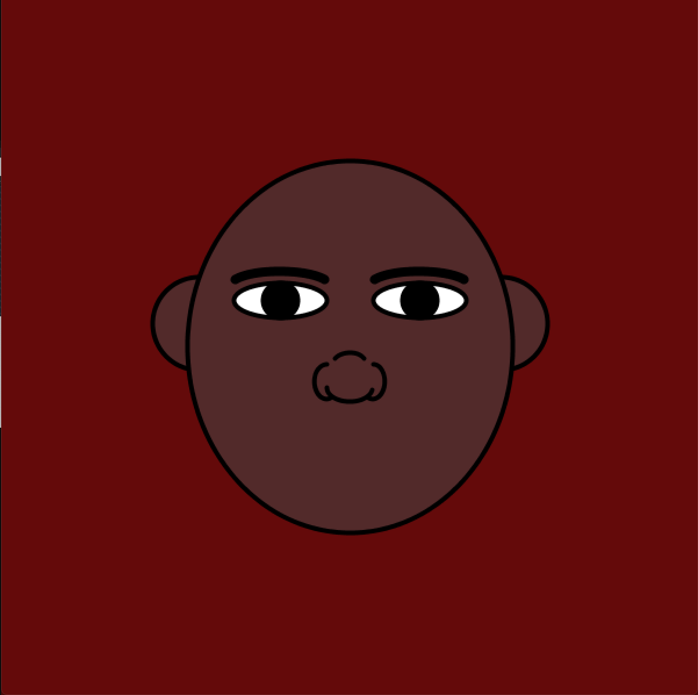
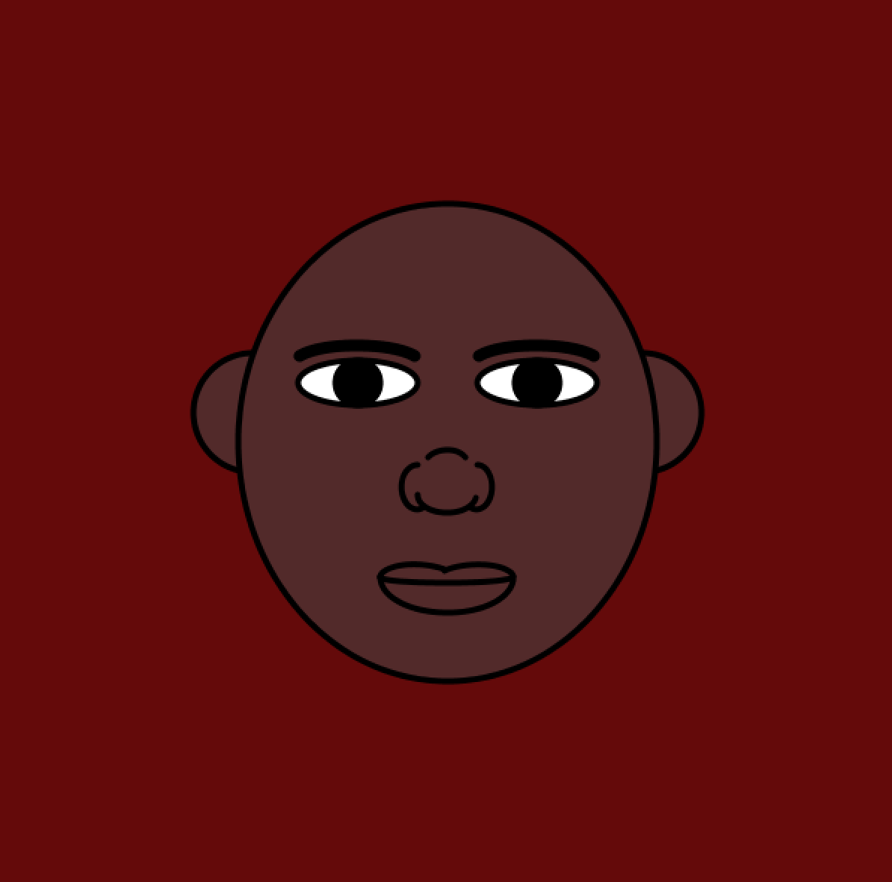
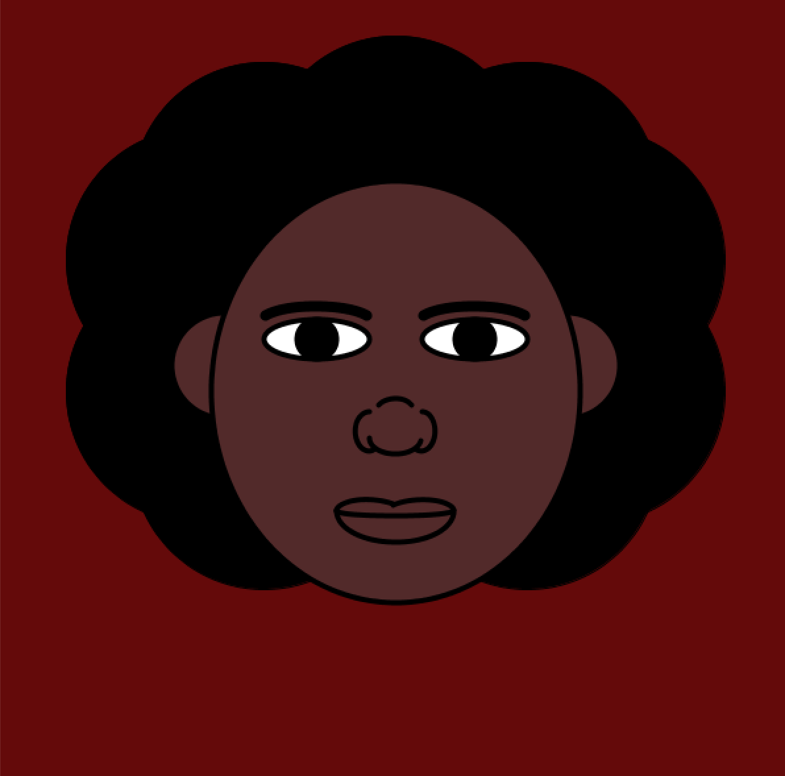
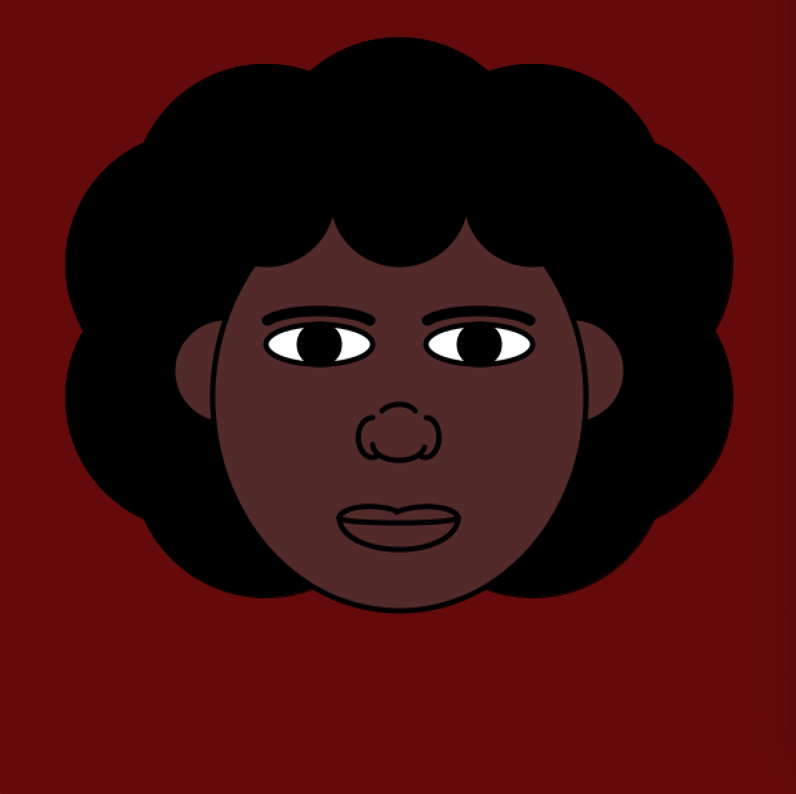

# ASSIGNMENT ONE:SELF-PORTRAIT
## Description:
- This assignment requires students to make self-potraits using processing. Given that this is the first assignment in the course, the students are only required to use basic in-built functions to come with different shapes and facial features.
- The portrait need not be dynamic or realistic, but should be entirely coded by the students. 
## The process:
- I particularly enjoyed coming up with ways to integrate as many features as possible on my self-portrait. I was able to use the reference page that is available to us. From that, I not only read what different functions do, but I also put them into use... which further helps me put my knowledge into use.
- Below are screenshots of the different stages of the construction of this portrait

These are basic ellipse shapes to draw the facial structure and ears

Eyes and eyebrows were added soon by using the ellipse function (for the eyes and irises) and arcs for the eyebrows

The nose was particularly hard to come up with because each corner needed to be made of either an arc or curve. I am pleased with the outcome, and even so... because after that, I was more comfortable to work with arcs.

I chose closed lips. These are 4 arcs in total. 2 for the upper lip, one for the lower lip, and one for the line in-between

I used overlapping ellipses to make the hair into an afro shape. I still did not like how the forehead looked, which explains the next step I took.

I added three ellipses at the front, and that gave my portrait a finished look. I was well pleased with this, so I used rectangles and triangles for the remaining body parts. 

... The finished portrait is revealed at the end
### Difficulties:
- The main challenge was hard-coding values. As a previous computer science major, I was taught that hard-coding values is not a good coding habit. Therefore, when I started this assignment... I had a hard time coming to terms with the fact that perhaps human faces are not as symmetrical and proportional as I would want them to be. Yes, including my own. This realization forced me to hard-code some values to give me the desired facial features.
- The other challenged I faced was working with curves. As tempting as it was, I tried to use as few straight lines as possible, because there are almost zero parts of the human body that are actually straight. Therefore, I had to learn to use arcs and how to emloy different modes to achieve the curvature I desired for my portrait. All in all, this was a great learning experience.
### Interesting things I discovered:
- Perhaps the coolest feature I discovered was the color selector in the tools section of processing. I was having a hard time coming up with the right shade for my skin tone as well as my eyes and hair... and after googling and watching a couple of Youtube videos, I discovered that there is a color selector that lets you pick the color you want first, then gives you the RGB values. I think that is pretty cool and efficient.

## Outcome:

