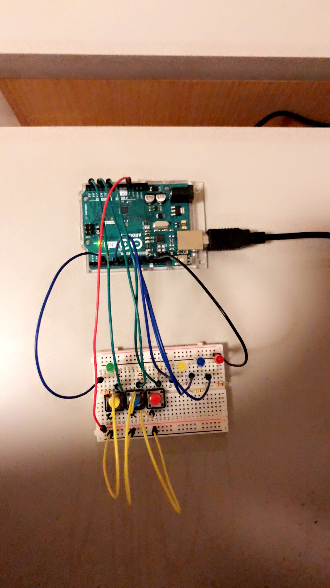
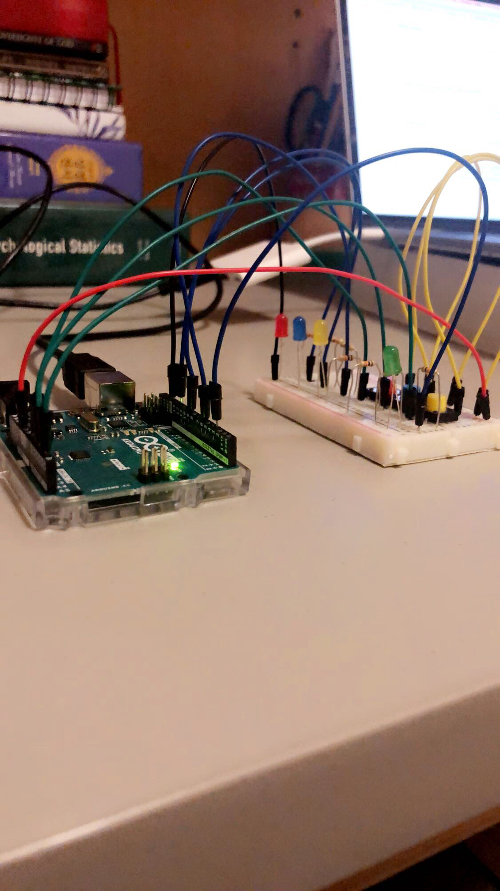
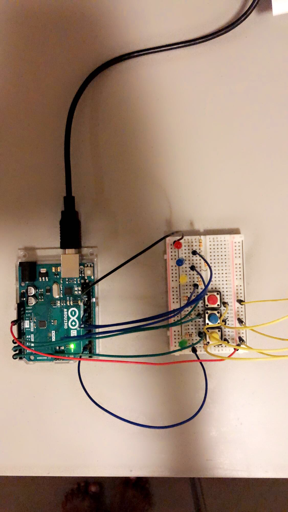

# ASSIGNMENT FIVE: ARDUINO PUZZLE
- This assignment requires students to use arduino to make a puzzle that can be solved using at least three momentary switches and three LEDs.
- The puzzle should be somewhat complex, in that each switch should not simply control a particular LED, but rather do more than that.

## Description:
- In my puzzle, the user is prompted to select a word from a list of multiple choice words after they have been shown a description. For example:
    "Definition: The color of the sun "
    The user will be given 5 options and they should enter a number for the correct choice... in this case, yellow would be one of the options.

- Below are the instructions:
   - A definition will be presented to you on the monitor.
   - Enter your option (from 1 -5) of your guess for the described word in the buffer of the serial monitor
   - The LEDs will flash either blue (for right) or red(for wrong)
   - Click the red button to stop the red LED from blinking and to see how many trials you have left; the yellow LED will flash the number of trials you have left.
   -If you get the guess right, the blue LED will flash until you click the blue switch to move on to the next part.

   - Do not enter 0 as an entry

## Schematic:

## The process:
- I enjoyed the process for the most part. I had to rely on the arduino reference page, class readings, and recordings to ensure that I really understood what I was being required to do. Overall, I was able to create something easy and fun. I am not impressed with the outcome, however, because mainly... I have been having more difficulties with arduino compared to processing, the main reason for that being that I had already used processing before as a computer science student, but arduino was new... so I had to learn everything from scratch.I was pleased to learn that the syntax shares a lot of similarities with processing.

- I started with making a basic circuit and I had to figure out what my three LEDs would do, so I used a for loop to ensure that they would be able to blink thrice until a corresponding switch was on.

```Arduino
while ( digitalRead(redSwitch) == LOW) //if the red switch is not pressed ... 
  {
    for (int i = 0; i < 4; i++)
    {
      digitalWrite(redLed, HIGH);
      delay(150);
      digitalWrite(redLed , LOW);
      delay(150);
    }
    delay(300);
  }
```

- After doing that for the other two switches as well... I was able to move on to getting the user's input and storing it into a variable.
```Arduino
while (Serial.available() == 0)
    {
      ;//waiting for user's input
    }
    user_guess = Serial.parseInt(); //get user's input
```

- I then used that input to match it with the answer of the question. If they matched, I would blink the blue light until the user decided to move on. Otherwise, the red light would blink, until the user decided to move on by clicking a different switch. After getting a question wrong, the yellow light will also blink the number of trials left for the user. 

```Arduino
if (user_guess == 4 ) 
    {
      got1 = true; //set that they got the first word true
      numTrials = 6; //reset the num of trials
      RightBlink(); //show the rightblink()
    }
    else 
    {
      numTrials -= 1; //reduce number of trials
      if (user_guess != 0)
      {
        WrongBlink(); //call wrongblink()
      }
    }

```

- I repeated these steps for each of the 5 words and that completed my Loop() function, where in the end I would check whether the user got all the words correctly or not. If they did, they would be informed nand the full statement would be displayed. Otherwise, they would be told that they lost... the words they missed would be displayed... and the full statement will also be shown to them.

## Difficulties:
- The main challenged I had with this assignment was figuring out how the serial.available() function works. I set the number of trials to 3, but it was repeating every call twice... so that made me have to double the number of trials to 6 to ensure the double calls are accounted for. But this ruined my tracking of trials ... and it made them 4. I tried debugging that for a very long time, but I still have not figured that out to this moment.
- The next challenge was that I was working on the assignment after it was due, so I had to undo my circuit in preparation for the Thursday class. It was frustrating... but I was still able to reconnect everything later and to go from where I had ended. 

## Interesting things that I discovered:
- I loved getting input from the user and being able to see the whole circuit and puzzle come together just based on what the user does. I could not picture it initially... but after a long time, I was able to put it together and that was quite satisfying.
- I discovered that once I switch an LED on, I could make keep it that way until a switch is clicked on again.

## Outcome:
- Below are photos of the outcome of the Board from different angles.




## Conclusion:
- Overall, I think I did an average job based on my condition this week. However, there are many areas of improvement including the fact that the yellow switch has no purpose. I could not think of any place to put it that would make it actually useful, so I would want to work on that even beyond the submission of this assignment. Other than that, I hope that this assignment is acceptable to Prof. Shiloh.
