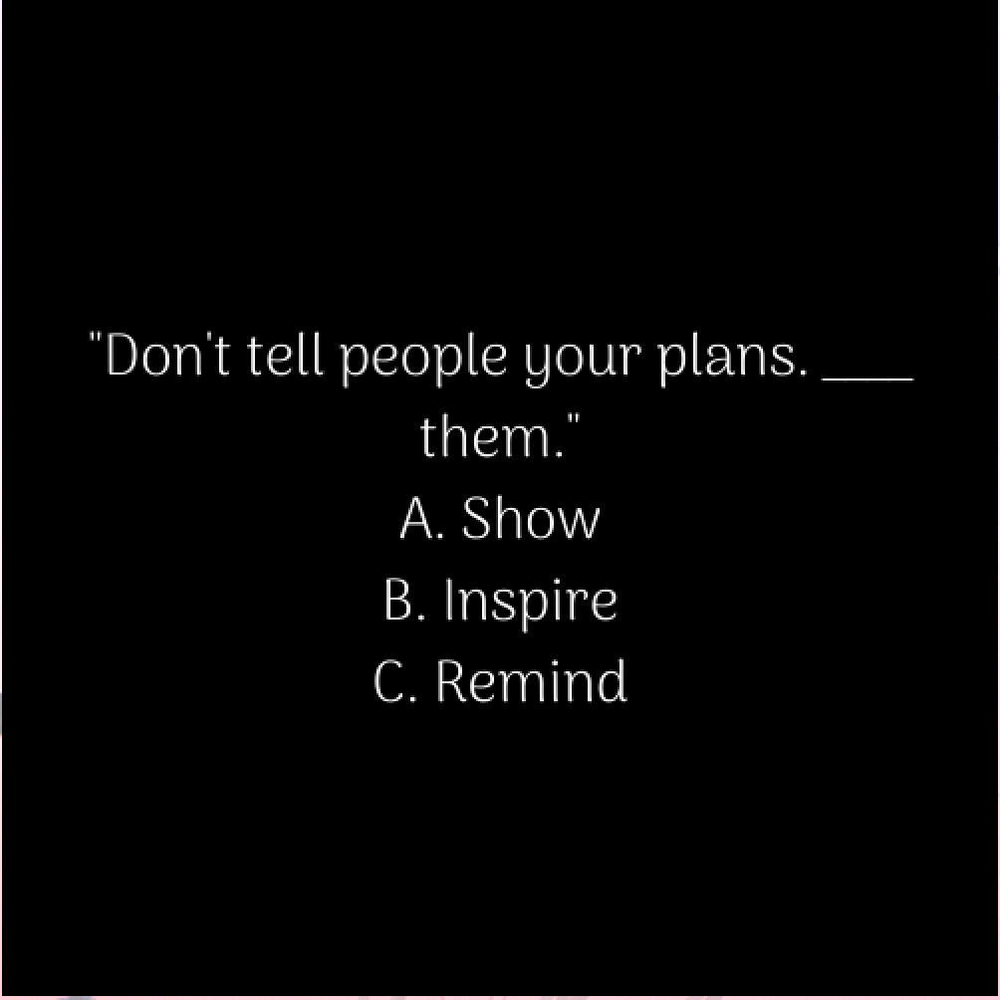

### Description:
- My final project is based on a program that will be asking the user to fill the blanks in quotes based on simple multiple choices. I initially wanted to make these questions progressive, but to simplify it... I decided that the user will only see one quote and the program will end. These will be sort of littel nuggets for the day.

### The process:
- It took me over a month to get myself to complete this project, but I finally made it, and I was able to push myself to come up with a simple idea to complete the project.

The inspiration came from my love for reading and mental health and wellness awareness. So, most of these quotes are going to be some motivational and inspirational quotes that I have come across in my life so far.

- I mainly focused on getting the basics running i.e. connecting arduino and processing, and then I decided to create a class for the questions/quotes. I added attributes to the class and made sure that it worked smoothly for one object and then I added more objects of that class.

- The next thing was creating an array list of the quotes, so I made it a global variable, and then I added all the quotes into the arraylist.

- This is not a game... so there is no winning or losing, but to get the right option, the user needs to click on the choice on the screen. If they get it right, the Blue LED light will blink, but if they get it wrong... the red LED light will blink. 

- The program restarts itself... and each time, the quotes are randomized, so one can keep the program running and they can expect a different quote each time.

### Difficulties:
- The biggest difficulty I faced was getting the motivation to start. This is due to several factors that I discussed with the professor.
- The other challenge was getting the answers to work. I wanted to make separate blocks for the answers, but I thought that would take me more time compared to having each question come in a photo, and to already have its options. This, however, meant that I had to hard code the values of the answers... which I didn't , because I was already running out of time.

### Interesting things I discovered:
- Array lists are much simpler to work with compared to arrays. I worked with arrays in my midterm project, and I struggled. But, arraylists come with their own methods... so they are much much better to use. 

### Outcome:
- Below are screenshots of the start screen, a sample question, and a photo of the breadboard.

