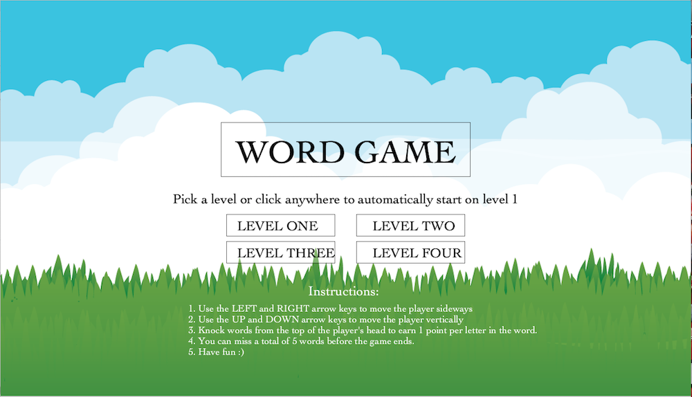
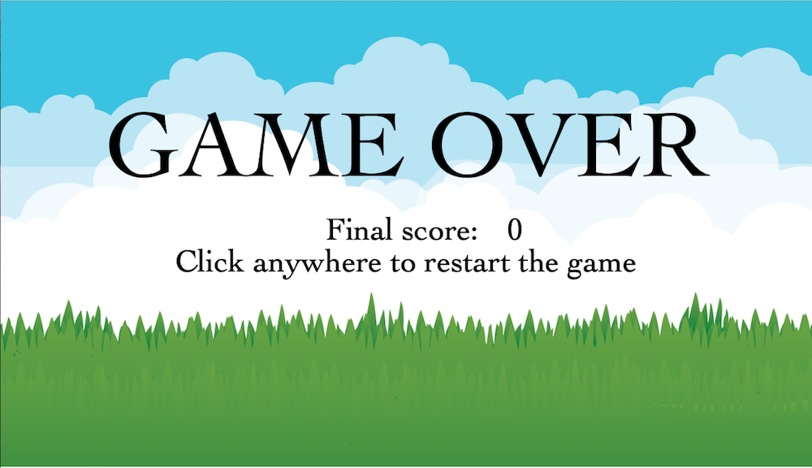

# MIDTERM PROJECT: CATCH ME IF YOU CAN!

## Description:
- This is a game of words falling from the sky. The main task that the player has it to catch the words and to make sure that not more than 5 words are lost. Initially, words fall slowly so that the player can familiarize themselves with the game, but as the game proceeds, more words fall and at a faster speed. The player has four ranges of motion: UP, DOWN, LEFT, RIGHT and they can be achieved by using the respective UP, DOWN, LEFT and RIGHT arrow keys on their computer. If the player manages to score all the points in the words, they will receive a message telling them that they won, otherwise, they will be told that the game is over, and their score will be displayed on the end screen:

### - Instructions:
- Use the LEFT and RIGHT keys to move sideways
- Use the UP and DOWN keys to move vertically
- Knock the words as they fall.
- Make sure that not more than 5 words are lost

All these instructions are found on the start page along with the options of levels that they can pick from:
 

And their score and results are displayed at the end like so:
 

## Inspiration:
- This game was inspired by a game that I used to play in elementary school during my typing class. We were given some prompts that we had to type into the computer, and once we completed those prompts, we were allowed to play games... and this happened to be my favorite game. I tried looking for it online, but I could not find it, however, I would still like to give credit to the original creators of the game. This game helped me learn a lot of vocabulary because it was so advanced and there were so many levels and categories to pick from. Therefore, I plan to store it and let my little brother and niece play once I go back home for the summer. 

## The Process:
- For a more detailed process, please look into my journal.md file, where I documented by daily progress with the game. Below is a much more generalized and summarized decsription of what the process looked like:

## Major problems:
- The first issue was that I could not figure out how to end the game. I knew that once the player got all the points, then I would let them win, but I could not put it into code based on the way I had set up my game. Initially, I was checking for both in the same function, so that was hard to navigate because I had more than two options, i.e I was only checking for winning or losing, while the player could have either, or neither.

- The second issue started when I figured out how to end my game... then I could not restart it. I thought of multiple ways to do it i.e using mouseClicked and functions and flags to detect whether the player is alive, but none of it seemed to work well. I needed to figure this out, not only because it was a requirement, but also because I wanted the player to have multiple levels. At that point, I only knew how to move from one level to another... but after level four, the game just froze. 

- The third issue that I faced was that I decided to use an array instead of an arraylist, so I had a hard time figuring out how to delete objects from the array. Having coded in both C++ and Python, I was spoiled by having in-built methods that could do this for me. So, I struggled with the idea that there was no quick fix to me deleting objects from my array of words. I needed to do this for the words that were either knocked by the player or lost, because I did not want them to be displayed anymore. Furthermore, this led to a bug that took me a whole day to fix, because the last word was being created multiple times, hence causing the game to end once it reached the ground. 

## Modifications and Solutions:

- To fix the first problem, I made a Game Class, so that my game was an object that would be instantiated each time the player clicked the mouse. And, once the game ended, I would make the game object null (to delete it), and I would wait for the player to click the mouse so that the object is re-created once more. This was a very quick fix, and it also helped me because I could make as many levels as I want just because everything was already in a class.
- To solve the second hurdle, I decided to use two separet functions in order to check for winning or losing separately. I realized that they have very different mechanisms, and that it would be wrong to want to check for both given the set up of my game. 

- I decided to make an arraylist of the positions of all the words that had been knocked by the player. And then, before displaying any word, I would check to confirm if the word had been knocked or not. If it was, it would not be displayed or updated. The other possible solution was to make the objects null if they were either knocked or lost, and then I would only displayed objects that were not null. 

## Interesting things I discovered:
- I think the most interesting aspect of all of this is just how anything is possible with coding. As a five-year old, I would never believe that some day I would be able to code the very game that I was playing on my screen during typing class. That game was one of my highlights in elementary school, and I am so proud of myself that I was able to replicate it. 
- In terms of technical things: I used the fourth element of fill() for the first time, and that was pretty exciting. I also played with so many fonts, till I settled for "Cochin", which is the one I am using. I was also surprised by my own ability to pivot, because I faced so many challenges (beyond the ones described), but I did not give up on trying to make this game a reality.  

## Outcome:
- Below are some videos on the different levels of the game and how it is played:

## Potential areas of improvement:
- I would like to make a list of categories of words to be used by the player. For example, Level one should be just animal names, and level two could be just plants, and another level could be just countries... and many more things. This game has a great potential, and it could be used to teach young kids. 
- I would also like to add sprites per level. As cute as smiley faces are, I still think sprites have better graphics and they would be more fun because they are animated. 
- I still think that the graphics could be better. I will hopefully still be working on this game even after it is due, so I have a couple of ideas that I want to implement to make it even better.
- There is room for multi-play. I could easily create another player object and allow them to play with different keys... and the words could have different colors per player, so they will have to make sure that they catch their respective words, whilst avoiding the other player's words. 

## Conclusion:
- This was an amazing experience. I am so happy that I was able to make this game from scratch despite my initial fear of not being able to complete this whole project. I look forward to my next big project, because this has confirmed that there is some creativity in me ;))))). 
