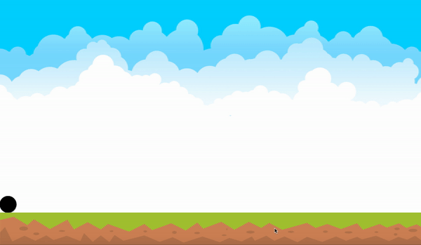
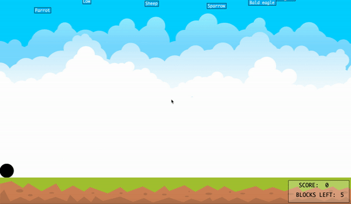
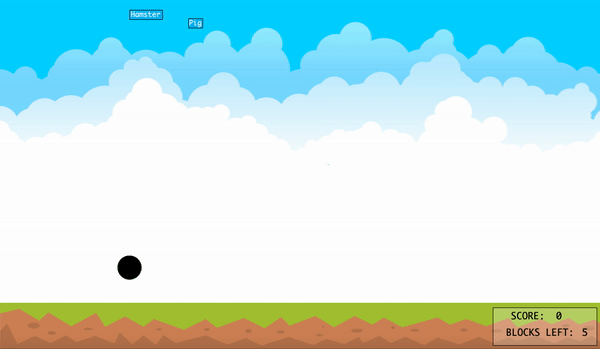
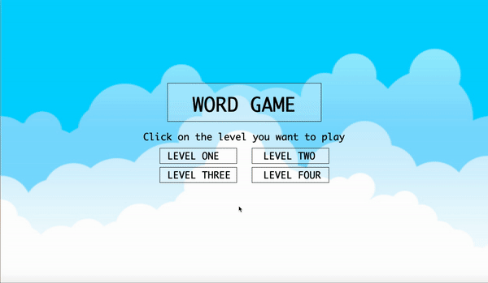
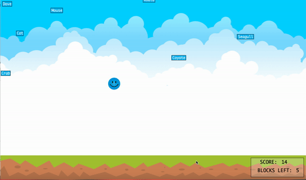
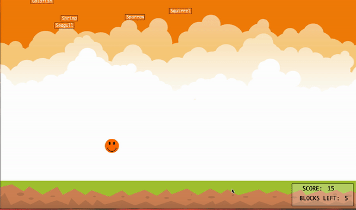

## MY MIDTERM PROJECT JOURNAL

### DESCRIPTION:
With my midterm project, I am planning to create a word game that will involve words falling from the sky and a character collecting the words. This game was inspired by a game that I used to play in elementary school during my Typing class sessions. We were given short prompts that we had to type into the computer, and once we were done, we were allowed to play the game. The difference between that game and mine is that in mine, players have to jump and move around to collect the words, but in my elementary school typing class, players had to type in the words they see. 

I could not find the game online, so I cannot directly atach a link. However, I would still like to acknowledge that this is not fully my idea. 

### JOURNAL ENTRIES:

<div align = "center">
  <br></br>
  <hr></hr>
  <h3> <u> <b>  Friday 19th February, 2021  </b></u></h3>
  <hr></hr>
  </div>
  
Today, I focused on three main things:
- I opened a new document and added in a description of my program (that includes my name, date created, last modified, as well as a simple description of what the program does and any instructions to the user. This is to help me in my documentation of all my programs as well as anyone who would want to quickly skim through my work. It also helps Prof.Shiloh when he checks the code, so that he knows how exactly the program works. 

- Next, I decided to add skeletons of the main functions and classes that I would need in the program. This was just to help me have an idea of how much work I would need to do, so that I could plan ahead. I know that the actual needs may change as the program goes, but it is always nice to have clarity and some sort of direction before actually starting to code. 

- Lastly, I decided to load the background images that I had for the game, and to display them when the game begins. This was to just help me get a feel of whether I liked any of the photos, and whether they would match my preferences. I also decided to go ahead and add a platform i.e. the place that my character will be standing on. I wanted to also figure out the dimensions of this platform , which would further help me in my calculations as the game progresses. I then also decided to position my character. I hard-coded the x and y positions as well as the height and width for an ellipse, but again, that was only because I was trying to get the proper dimensions of the character. 

 - The final code is shown below:
 
```Processing
/*
 Name: Nelda John
 Date created: 14-02-2021
 Last modified: 18-02-2021
 Due date: 04-03-2021
 
 Description:
 This is my midterm project in the Introduction to IM course:
 - This code displays Nelda's application of all the concepts learnt from the beginning of the semester including the use of functions, classes, conditional statements,
 loops, and many other concepts. The main aim of this project, however, is to apply concepts of Object-Oriented Programming.
 
 Usage:
 - There is a character that is supposed to jump up and down, or move left and right to "catch" words that are falling from the sky. Every time the character knocks a word, it gains 
 points equal to the number of letters in the word. The character has the chance to miss only 5 words, and after that, the game will be over. To win the game, they should score all the words.
 As the game runs, the score and the blocks left to lose are shown in the bottom right corner. If the game ends, the player is told whether they successfully got all words or not, and the game
 restarts.
 */

//global variables
/*
wordsArray 
 gameScore
 blocksLeft
 numberOfWords
 */

void setup()
{
  size(1280, 720);
}

void draw()
{
  //load and show background
  PImage my_background = loadImage("media/blue_background.png"); 
  image(my_background, 0, 0);
  //load and show platform
  PImage my_platform = loadImage("media/platform_8.png");
  image(my_platform, 0, height-100, width, 100);
  
  //show circle (player)
  fill(0);
  ellipse(25,height-125,50,50);
}

class Player
{
  //attributes [xpos, ypos, width, height, gravity, x_speed, y_speed, radius]
  //constructor method
  //gravity method
  //update the player's position
  //show the player
}

class Platform
{
  //attributes [xpos, ypos, width, height]
  //constructor method
  //display the platform
}

class Word
{
  //attributes [xpos, ypos, width of the box, height of the box, color of the box]
  //constructor method
  //update the word's position
  //show the word
}
```
And the outcome looked like the one below:


#### What worked:
- The main thing that worked was that the platform I used had fit in perfectly with the height and width of my canvas. I tried several platforms, but they all were either stretched in the x or y directions and they looked blurry. So, I'm glad that I found one that actually works and looks good.


#### What didn't work:
- Since I did the bare minimum, I did not come across many hurdles. The main issue was that I displayed the platform and the circle before the background, so when I ran my program, I only saw the background. However, that was easily fixed with just moving the lines to where they belong and everything worked just fine.

#### Modifications:
I plan to display the platform and the player from their own classes. So, I will move the statements to their respective classes, and I will only call the show methods for each object. I also want to start working on the word class, because that will help me advance by a lot in the coming days. 


<div align = "center">
  <br></br>
  <hr></hr>
  <h3> <u> <b> Saturday 20th February, 2021 </b> </u></h3>
  <hr></hr>
  </div>
  
Today, I focused on these main things:
- I worked on the player and platform classes. In both classes, I declared the variables responsible for my object's attributes and then I assigned values to them in their constructors. 
- For the platform class: 
  - I added a showPlatform() method in which I load and display the platform like I had done in the draw function yesterday. This is super useful, because I can then detect the collision of the words when they hit the platform, and this will affect how many blocks are left for the player to lose. This is what the code looks like now:
 ```Processing
 class Platform
{
  //attributes
  int x_pos, y_pos;
  int pWidth, pHeight;

  //constructor method
  Platform(int aXpos, int aYpos, int aWidth, int aHeight)
  {
    x_pos = aXpos;
    y_pos = aYpos;
    pWidth = aWidth;
    pHeight = aHeight;
  }

  //display method
  void showPlatform()
  {
    fill(0); 
    PImage my_platform = loadImage("media/platform_8.png");
    image(my_platform, x_pos, y_pos, pWidth, pHeight);
  }
}
 ```
- For the player class: 
  - I added the updatePosition() method and I also gave the player a showPlayer() method. I decided to work further on the updatePosition method, so as to allow some movement for my player. I chose to give the player four different ranges of motion (i.e UP, LEFT, RIGHT, and DOWN). I incorporated this into my player's movements by using the keyCode() function in processing. Initially, I could not detect key releases and I did not want to add key handlers, so I decided to enclose everything into an If KeyPressed() function, so that the commands only work when the key is pressed, and not when the key is released. I also think this will be useful in applying gravity, although I am starting to wonder if I will need both gravity() and the DOWN keyCode(). I will decide this as I go, but in the mean time, I will work with the DOWN key alone, but still reserve some space for potentially including gravity later on. This is what the two methods look like:
```Processing
  class Player
{
  //attributes
  float x_pos, y_pos, pWidth, pHeight, pGravity;
  float pRadius = 25;
  float x_velocity = 25;
  float y_velocity = 25;
  boolean alive = true;

  //constructor method
  Player(float aXpos, float aYpos, float aWidth, float aHeight, float aGravity)
  {
    //set all the attributes using the constructor
    x_pos = aXpos;
    y_pos = aYpos;
    pWidth = aWidth;
    pHeight = aHeight;
    pGravity = aGravity;
  }

  //method that controls the player's gravity
  void gravity()
  {
  }

  //method that updates the player's position
  void updatePlayer()
  {
    //check if the ball is within the canvas
    if ((x_pos >= pRadius) && (x_pos <= width-pRadius) && (y_pos <= 635) && (y_pos >= pRadius))
    {
      if (keyPressed)
      {
        //if the player picks right
        if (keyCode == RIGHT)
        {
          if (x_pos < width-pRadius)
          {
            x_pos +=  x_velocity;
          }
        } 
        //if the player picks left
        else if (keyCode == LEFT)
        {
          if (x_pos > pRadius)
          {
            x_pos -= x_velocity;
          }
        } 
        //if the player picks up
        else if (keyCode == UP)
        {
          if (y_pos > pRadius)
          {
            y_pos -= y_velocity;
          }
        }
        //if the player picks down
        else if (keyCode == DOWN)
        {
          if (y_pos < height- (100+pRadius))
          {
            y_pos += y_velocity;
          }
        }
      }
    }
  }

  //method that shows the player
  void showPlayer()
  {
    updatePlayer(); //update the player's position first 
    fill(0);
    ellipse(x_pos, y_pos, pWidth, pHeight); //show the player's position
  }
  }
  ```
- I also started to work on the Word class, because now that the player could move, I could also make the words move. But, my main issue here is that I want the words to start coming down slowly at first and then they can start dropping down faster. I still can't see how I will do that, but all I know for now is that I will have to have the words in an array. I am considering an arrayList, because it is flexible, and I can use the methods it comes with, but for the sake of simplicity, I will just use an array for now, especially because I know the exact number of words I have in my csv file. I included an updateWord() function too, because I would need the words to be falling, that means that they will need their positions to be updated constantly. 
```Processing
class Word
{
  //attributes
  float x_pos, word_width, word_height, word_colorR, word_colorG, word_colorB, word_speed;
  float y_pos;
  String the_word;

  //constructor
  Word(String aWord, float aXpos, float aYpos, float aWidth, float aHeight, float aColorR, float aColorG, float aColorB, float aSpeed)
  {
    the_word = aWord;
    x_pos = aXpos;
    y_pos = aYpos;
    word_width = aWidth;
    word_height = aHeight;
    word_colorR = aColorR;
    word_colorG = aColorG;
    word_colorB = aColorB;
    word_speed = aSpeed;
  }

  //update the position of the word
  void update()
  {
    if (y_pos < height)
    {
      y_pos += word_speed;
    }
  }

  //method that shows word
  void displayWord()
  {
    fill(word_colorR, word_colorG, word_colorB);
    rect(x_pos, y_pos, word_width, word_height);

    //typing the word
    PFont f = createFont("monaco", 15);
    textFont(f, 15);
    fill(255);
    textAlign(CENTER);
    text(the_word, x_pos+(word_width/2), y_pos + (3*(word_height/4)));
  }
}
```
- I also wanted to display the game score (so that when I can detect knocks, I will just increase the score), so I used the global variable gameScore that I initiated in the very beginning of the game, and I set it to increment by the number of letters in the word scored. I put this on top of the platform, so that it would not interfere with the words falling and it would also still not obstruct the platform, because I used the opacity function. 


- I decided to load the csv file that contains all the words that I will be using in the game. I loaded the words in the setup function, because I only want this to be done once. Then I am going to display them all together by using a for loop. Because I already have a showWord() method in my word class, I can just call one method for all objects in myWordsArray. Below is the code for what that looks like as of now: 
```Processing
  words = loadStrings("animals.csv"); //load the animal data
  numberOfWords = words.length;
  //use a for loop to add all the words in the list to an array
  for (int i = 0; i < words.length; i++)
  {
    float my_length = random(-3000, 0);
    Word myNewWord = new Word(words[i], (i+1)*25, my_length, 10*(words[i].length()), 20, 73, 182, 237, random(1, 5)); 
    myWordsArray[i] = myNewWord;
  }
```

Outcome:

- This is the what the ball's movements (using keyCodes and keyPressed) look like so far:


- This is what the words falling look like so far. (I initiated them at a negative y position and increased each by a random number):


#### What worked:
- I was really happy that I was able to move the player within the canvas' limits and with great ease. I was also excited to get the words falling. I think the hardest part was to get the actual words fit the boxes. I was able to figure out a simple formula to make sure that each box matched the length of the word itself. 

#### What didn't work:
- Some word objects are created outside the canvas, so only part are seen or they just don't show up at all. I also still haven't figured out how to make the objects start by falling slowly and then faster as the game proceeds. Furthermore, some of the words overlap with each other, because I decided to randomize the speed. 
- I also think that the graphics need a lot of work. I enioy great aesthetics, so I don't like it when my work doesn't look pleasing to the eyes. I understand though, that this should not be my main focus right now. Hopefully, once I fix this, I will be able to move on and to great a really aesthetically pleasing game with amazing graohics. 
- My computer started to slow down. I noticed that the loading time for the jave run screen was longer. It took a little longer for everything to run and that was kind of discouraging. But, I cleared some unnecessary things to save space, and I think that fixed it a little bit.

#### Modifications:
I want to work on the words speeding up as the game proceeds, because that will make it more exciting. I also want to fix the issue where words are formed outside the screen and I want to fix the words overlapping issue. Lastly, I want to hopefully be able to detect collision between the words. 
  
<div align = "center">
  <br></br>
  <hr></hr>
  <h3> <u> <b> Sunday 21st February, 2021 </b></u></h3>
  <hr></hr>
  </div>
 
 Today, I worked on the following things: 
 - I included a function that detects when the player and any word collide with each other. I used the x and y positions of each word and the player. The first issue that occured here is that the player's position is incremented only by 25 , while each word can move for a random number between 1 and 5. So, there were never points that their positions really matched. To solve this, I just decided to say that whenever the y_position of the word was greater than or equal to that of the player, then that would be considered a knock. 


```Processing
boolean Knock()
  {
    //prepare a new array list to copy all the words not scored
    ArrayList<Word> myNewArray = new ArrayList<Word>();
    boolean check = false;

    //iterate through the array of words
    for (int i = 0; i < myWordsArray.length; i++)
    {
      float y_knockPoint = (myWordsArray[i].y_pos + myWordsArray[i].word_height);
      float x_knockPoint = (myWordsArray[i].x_pos + myWordsArray[i].word_width);
      if ((y_knockPoint >= y_pos - pRadius) && (y_knockPoint <= y_pos + pRadius) && (x_pos+pRadius >= myWordsArray[i].x_pos) && (x_pos - pRadius <= x_knockPoint ) )
      {
        game_score += myWordsArray[i].the_word.length();
        myScoredWords.add(myWordsArray[i]);
        check = true;
      } else
      {
        myNewArray. add(myWordsArray[i]);
      }
    }

    int count = 0;
    //paste all the new 
    for (Word myword : myNewArray)
    {
      myWordsArray[count] = myword;
      count++;
    }
    return check;
  }
```
- Lastly, I wanted to also keep track of the number of words that the player lost i.e. the words that they player could not catch before they disappeared into the platform. I initially wanted to use the same function as the one that detects knocks because they use the same concepts, but I decided against that. I think it is nice to separate different attributes and operations by class methods, even if theya re similar. So, below is the code for the lostWords() function. 
```Processing
 boolean LostWords()
  {
    //prepare a new array to copy
    final int numWords = (myWordsArray.length);
    // int numWords = myWordsArray.size();
    ArrayList<Word> myNewArray = new ArrayList<Word>();
    boolean check = false;

    //iterate through the array of words
    for (int i = 0; i < myWordsArray.length; i++)
    {
      if (myWordsArray[i].y_pos < height-100)
      {
        myNewArray. add(myWordsArray[i]);
      } else
      {
        if (blocks_left > 0)
        {
          blocks_left -= 1;
        } else if (blocks_left == -100)
        {
          alive = false;
        }
        check = true;
      }
    }
    int count = 0;
    for (Word myword : myNewArray)
    {
      myWordsArray[count] = myword;
      count++;
    }
    return check;
  }
```
In the end, this was the outcome I got was the one below:


#### What worked:
- After so many trials, I was actually able to make the collisions smooth. I wanted to use distance and to say that whenever the distance between the player and any word is zero, then the score should go up, but that proved to be difficult because it involved more calculations. So, I decided to use x and y positions like desribed above. 

#### What didn't work:
- The main issue I faced today was detecting collisions between my player and the words. I tried different formulas, but I just could not get it to work until very late at night. I realized that initially I was checking for words that did not collide first, so that was trickier. And then I also used the wrong symbol (I used gerater than instead of less than), so that is why the player could catch words that were even just below the player's y position depsite not being close to the player's x position.
- I don't know what to do with the words that fall beyond the platform i.e. if the player doesn't catch them  
- I still haven't figured out a way to make the words not overlap. I think I will need to not randomize the speeds. But that would mean that the words will be falling in straight lines (which is boring). The other option is to make the words fall in grids, but they differ in size, so that will be tricky. I will be brainstorming a couple more ideas as the week goes on. I know I can fix this. 

#### Modifications:
Since everything is working well enough, I now want to have a start page where the users can click and start the game at their own convenience. To achieve this, I will need to move all the commands from the draw function into a class. Given that I plan to have several levels, I think I'll need to name this class LevelOne, and then I will name the others LevelTwo, LevelThree, LevelFour. That is, if I can do four levels - which is my aim.  
  
  <div align = "center">
  <br></br>
  <hr></hr>
  <h3> <u>Monday 21st February, 2021</u></h3>
  <hr></hr>
  </div>
  
Today, I worked on:
- Creating a main game class. I was able to move all my commands from the draw function into the main game class. Then I controlled when the game would start based on the MouseClicked() function. This means that when the game starts, the user can only see the cover page. But when they click anywhere with the mouse, then the main game class' show function is called, and then game proceeds like it was initially. Below is the code for the main game class as of now:

```Processing
//class level_frog
class Level_One
{
  //attributes
  float level_width, level_height;
  boolean gameStart = false;

  Player my_circle = new Player(25, 625, 50, 50, 10);

  //constructor method
  Level_One(float aWidth, float aHeight)
  {
    level_width = aWidth;
    level_height = aHeight;
  }

  //method that checks for win
  boolean checkWin()
  {
    return my_circle.WonGame();
  }

  //method that checks for losses
  boolean checkLoss()
  {
    if (my_circle.alive == true)
    {
      return false;
    } else
    {
      return true;
    }
  }

  //method that shows the level
  void showLevel()
  {

    if (gameStart == false)
    {
      background(0);
      PImage my_cover = loadImage("media/cover.png");
      image(my_cover, 0, 0);

      PFont f = createFont("monaco", 50);
      textFont(f, 50);
      fill(255, 255, 255, 60);
      rect((width/2)-200, (height/2)-150, 400, 100);
      //levels boxes
      rect((width/2)-220, (height/2)+20, 200, 40);
      rect((width/2)-220, (height/2)+70, 200, 40);
      rect((width/2)+20, (height/2)+20, 200, 40);
      rect((width/2)+20, (height/2)+70, 200, 40);

      fill(0);
      textAlign(CENTER);
      text("WORD GAME", width/2, (height/2)-75);
      textFont(f, 25);
      text("Click Anywhere to start", width/2, (height/2));
      textAlign(LEFT); 
      text("LEVEL ONE", (width/2)-200, (height/2)+50);
      text("LEVEL TWO", (width/2)+50, (height/2)+50);
      text("LEVEL THREE", (width/2)- 200, (height/2) + 100);
      text("LEVEL FOUR", (width/2) + 50, (height/2) + 100);
    } else
    {
      checkWin();
      checkLoss();
      PImage my_background = loadImage("media/blue_background.png");
      Platform my_platform = new Platform(0, height-100, width, 100);
      if (!(checkWin()) && !(checkLoss()))
      {
        //display the platform
        image(my_background, 0, 0);
        //show the player
        my_circle.showPlayer();

        //show the words falling
        for (int i = 0; i < myWordsArray.length; i++)
        {
          myWordsArray[i].displayWord();
          myWordsArray[i].update();
        }

        my_platform.showPlatform();
        my_circle.Knock();
        my_circle.LostWords();
        my_circle.WonGame();


        PFont f = createFont("monaco", 20);
        textFont(f, 20);
        fill(255, 255, 255, 60);
        rect(width-230, height-90, 220, 80);
        fill(0);
        textAlign(CENTER);
        text("SCORE: ", width-150, height-65);
        text(game_score, width-90, height-65);

        text("BLOCKS LEFT:", width-130, height-30);
        text(blocks_left, width-35, height-30);
      } else if (checkWin())
      {
        background(0);
      } else if (checkLoss())
      {
        background(255);
      }
      checkWin();
      checkLoss();
    }
  }
}
```
- Creating a start page with boxes for different levels. I am not pleased with the way it turned out, but I am glad that I have an idea of what I want to work on. I like that the boxes seem orderly and that I can use mouseX and mouseY variables to detect where the user clicked, so that I can display the correct level. This is what the start page looks like as of now:

- Changing my array of words into an arrayList. I realized that I will need to delete the words from the array so that Incan detect when the game is over. I need to do this both when the words get knocked by the player and when the words are lost by the player. That means that, currently I do not have a way to end the game. This means that the game will proceed even after all the words are knocked or all the words are lost. I tried doing this but my program crashed and I just absolutely failed to switch over. I will keep this at the back for now, then I will work on it. 


#### What worked:
- The main game class was successfully started. It also works just the way I wanted it too, so that means that it can be inherited and replicated for other levels too. 
- I was also able to make a start page and to get the game to start only when the user clicked the mouse:
  

#### What didn't work:
- I was not able to move my words into an array list. I still want to give this another try, because it will make my life so much easier, and it could make the game be used for almost any data set, because the number of words will not matter. 

#### Modifications:
- I need to fix the issue with the game not being able to end. I will either have to look for a way to delete elements from my array, or I will have to switch to an arraylist so that I can use the remove() method easily when there is a knock or a word is lost.
- I also need to introduce the actual character instead of the circle. There may be a few changes that need to be made, but given that the main model is working, I think this will not be an issue. 
- I need to introduce the end game page, so that when the game is over, the player is informed, their score is printed, and they are notified on whether they won or lost. This means that I will also need to look for a way to go back to the cover page from the end game page. I think I have an idea on how to do this. Currently, I think I may need to use mouseClicked() just like I did with the cover page. The other idea I have is to give the cover page a timer. I know that this is possible in python, so I may have to research on what it looks like for java. I would make the program sleep for , say 6 seconds while showing the end game page. And then I will immediately display the cover page again.

<div align = "center">
  <br></br>
  <hr></hr>
  <h3> <u>Wednesday March 3, 2021</u></h3>
  <hr></hr>
  </div>

Given that I hadn't worked on the game for so long, today I decided to finish it up and add all the modifications listed in the preceeding entry. Therefore, today I worked on:
- Adding a flag that changes depending on whether the game has ended or not. This was very easy to implement, so I just added a checker "WonGame" to see if they scored all the total points, or "blocks_left" to see if the user lost more than 5 blocks. 
- Adding the end game page. I figured that a simple "GAME OVER" and "SCORE: --- " would work fine. I also decided to add an extra line to let the user know that they could easily click anywhere to restart the game. The final end page looked like so:

- I also added smiley faces as characters in my game. I tried working with sprites, but given that I only started doing my final touches a day before the game was due, I could only do so much. However, this is a lesson that I will carry with me: Space out your work, Nelda!
- Lastly, I implemented the multiple levels that one could select in the beginning, and I also modified the start page to look like so:


- I also added background music when the game is proceeding. Then, I also added sound effects when the player knocks a word and when a word is lost. 

- Finally, this is what the game looked like while being played for Level one:


#### What worked:
- I was happy that all the above implementations worked great. I was able to figure things out within a very short amount of time. This was very exciting for me, because I was beginning to get worried that I wouldn't finish. I love that I found the right font for my game as well. I was quite worried that "Monaco" just wasn't for me... so I love "Cochin".

#### What didn't work:
- I noticed that some of the words were being created and displayed multiple times. I tried fixing this issue... but I just couldn't figure out a way. I reached out to Prof.Shiloh, and he was kind enough to take a look at my code and to guide me towards potential areas that could have caused this. However, after fixing all of that... the game still produced this error. I plan to work on it tomorrow, so hopefully I will get it done.

#### Modifications:
- Fix the issue of some word objects being created more than once and being displayed several times.


<div align = "center">
  <br></br>
  <hr></hr>
  <h3> <u>Thursday March 4, 2021</u></h3>
  <hr></hr>
  </div>

Today, I was able to fix the issue of objects being formed multiple times, I realized that I was deleting objects from the wordsArray once they got knocked, but when displaying... I was still looping the same number of times as the original number of elements. So, for example... if I knock one word, the reamining number of words is 70, but my for loop would go for 71. 

#### What worked
- I decided to still loop 71 times, but I would store the position of all the knocked up words, so my for loop would skip any position in the list of "scored" words. This worked effectively, and I think now my game is ready to go.

#### What didn't work:
- My initial plan was to include a different category per level, but given the time-crunch, I was not able to do that. However, I will still keep modifying the game, because I want my little brother to play it. Given that my target audience is small kids, T still think the different background colors and smiley faces will impress them. Finally, this is my outcome:


#### Modifications:
- I would love to add different categories per level, and to also include sprites instead of plain smiley faces. Overall, though I am impressed with my work, and I am proud of what I have accomplished with this project.


